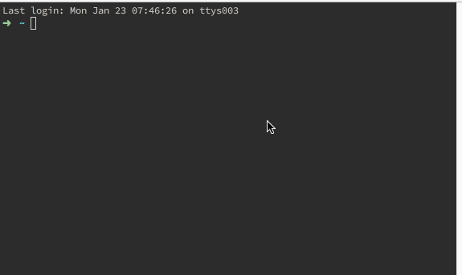

# Hello World NPM

Publish to publish to NPM.



## Installation

```
npm install -g nimstall
nimstall -g hello-world-npm
```

## Usage

### In Your Source Code

```
import { helloWorld } from 'hello-world-npm';

console.log(helloWorld());

```

OR

```
import HelloWorldNPM from 'hello-world-npm';

console.log(HelloWorldNPM.helloWorld());

```

OR

```
import HelloWorldNPM from 'hello-world-npm';

console.log(HelloWorldNPM());

```

### Command Line

```
hello-world-npm
```
